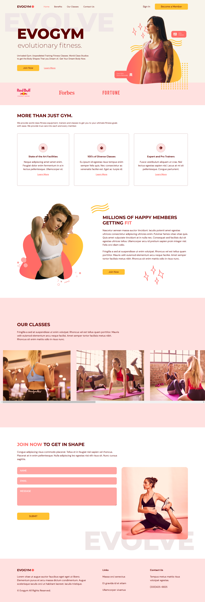

# EvoGYM 🏋️‍♂️💪

EvoGYM is a modern gym website built using React, TypeScript, and Vite. This project integrates essential libraries and features to deliver a smooth and dynamic user experience. 🏃‍♂️

## Preview 🖼️


## Features ✨
- **React with TypeScript**: Ensures strong typing and robust development.
- **Smooth Animations**: Powered by `framer-motion`. 🎥
- **Smooth Scrolling**: Implemented using `react-anchor-link-smooth-scroll`. 🌐
- **Modern Icons**: Leveraging `@heroicons/react` for high-quality SVG icons. 🖍️

## Installation and Setup 🔧

Follow these steps to set up the project locally:

1. Clone the repository:
   ```bash
   git clone <repository-url>
   ```

2. Navigate to the project directory:
   ```bash
   cd EvoGYM
   ```

3. Install dependencies:
   ```bash
   npm install
   ```

4. Run the development server:
   ```bash
   npm run dev
   ```

5. Open your browser and navigate to:
   ```
   http://localhost:3000
   ```

## Folder Structure 📂
```
EvoGYM/
├── node_modules/
├── public/
├── src/
│   ├── assets/
│   ├── hooks/
│   │   └── useMediaQuery.ts
│   ├── scenes/
│   │   ├── benefits/
│   │   ├── contactUs/
│   │   ├── footer/
│   │   ├── home/
│   │   ├── navBar/
│   │   └── ourClasses/
│   ├── App.tsx
│   ├── index.css
│   ├── main.tsx
│   └── vite-env.d.ts
├── .gitignore
├── index.html
├── package-lock.json
├── package.json
├── postcss.config.cjs
├── prettier.config.cjs
├── README.md
├── tailwind.config.cjs
├── tsconfig.json
├── tsconfig.node.json
└── vite.config.ts
```

## Additional Dependencies 📦

The following libraries are used to enhance the functionality of the project:

- `framer-motion`: For smooth animations. 🎨
- `react-anchor-link-smooth-scroll`: For anchor link smooth scrolling. 📜
- `@heroicons/react`: For modern SVG icons. 🛠️
- `@types/react-anchor-link-smooth-scroll` and `@types/node`: TypeScript definitions.

## Contribution 🤝

Contributions are welcome! Feel free to submit a pull request or report issues. 🚀

## License 📜

This project is licensed under the [MIT License](LICENSE).
